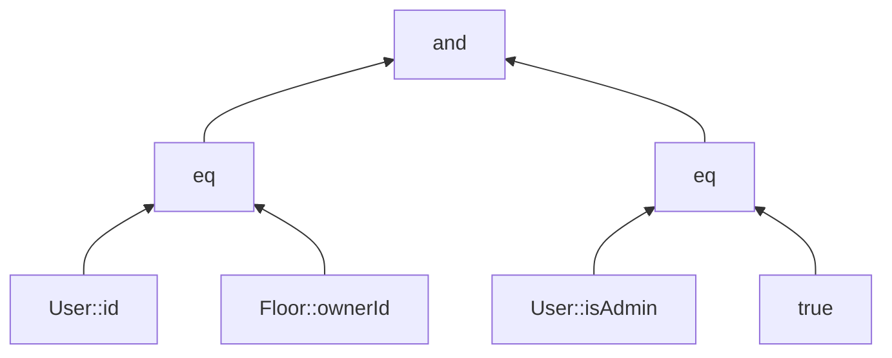

# Condition DSL mit Typsicherheit und Generics

Wir haben generics in die Condition DSL eingebaut. Da wir die möglichen Kombinationen beschränken wollten auf:

```kotlin
Foo::bar == 1
1 == Foo::bar
Foo::bar == Buz::qux
```

mussten wir mehrere Überladungen für den `eq`-Operator anlegen.

Auch bei dem unvollständigen Typen mussten wir zwischen "Value" und "Property" Typen unterscheiden

Merke: Der Unterbau ist nicht Typsicher! Wir haben also einen Typsicheren "Überbau" für Legacy-Code geschrieben.

# Condition DSL 2

Die Operator-Reihenfolge wurde wieder durch das Typ-System sichergestellt. Wir verwenden "unvollständige" Typen. Diese entsprechen zum einen nicht dem erwarteten Rückgabetyp, und zum anderen werden Extension-Functions bereitgestellt, um aus diesem unvollständigen Typ wieder den korrekten zu bauen, dessen Semantik erwartungskonform ist.

```kotlin
infix fun Condition.and(right: Any) = IncompleteConjunction(this, right)
data class IncompleteConjunction(val left: Condition, val right: Any)

```

# Condition DSL

Wir gingen einen ersten Schritt hin zu einer Condition DSL, die sich ähnlich schreibt wie Boolesche Ausdrücke in vielen üblichen Sprachen, u. A. kotlin.

Wie zuvor verwenden wir infix-Funktionen als Operatoren und begannen mit einer expliziten Klammerung um die Operator-Reihenfolge zu umgehen.

```kotlin
forSubject<User> {
    grant permission "JANITOR" whenAccessing Floor::class where {
        (User::id eq Floor::ownerId) and (User::isAdmin eq true)
    }
}
```


# JPA Criteria API 2

Wir können nun alle Kombinationen aus Gleichheits-Vergleichen mit unterschiedlichen Typen in ein `Predicate` überführen.

Damit dies funktionieren kann, ohne dass unsere Sprachelemente die JPA kennen, muss ein sogenannter [Double dispatch](https://en.wikipedia.org/wiki/Double_dispatch) durchgeführt werden. In den meisten Sprachen bietet sich dafür das [Visitor Pattern](https://en.wikipedia.org/wiki/Visitor_pattern) an.

In Kotlin haben wir durch Extension-Functions und den `is`-Operator allerdings eine weniger umständliche Möglichkeit. In kombination mit `sealed` interfaces/classes konnten wir die stärken von Kotlin hier voll ausspielen.

```kotlin
fun Condition.toPredicate(cb: CriteriaBuilder, criteriaQuery: CriteriaQuery<*>): Predicate {
    return when(this) {
        is Equals -> cb.equal(this.left.toPredicate(cb, criteriaQuery), this.right.toPredicate(cb, criteriaQuery))
        is Conjunction -> cb.and(this.left.toPredicate(cb, criteriaQuery), this.right.toPredicate(cb, criteriaQuery))
    }
}
```
# JPA Criteria API 1

Wir haben unsere `Condition` in ein `Predicate` aus der JPA Criteria API umgebaut.

Zunächst haben wir uns auf die Übersetzung von genau einem Muster konzentriert:

```kotlin
Foo::bar == "literal"
```

# Generics

Für `forSubject` haben wir eine [inline Function mit reified Typparameter](https://kotlinlang.org/docs/inline-functions.html#reified-type-parameters) verwendet. Dieses erlaubt es die Klasse für `Subject` nicht als Literal (`Foo::class`), sondern als Typ-Parameter (`forSubject<Foo>`) anzugeben, und trotzdem auf die Klasse zugreifen zu können.

Für `Target` haben wir davon abgesehen, damit wir den dreier-Rhythmus für die Infix-Funktionen beibehalten können.

```kotlin
forSubject<User> {
    grant permission "JANITOR" whenAccessing Floor::class where {
        Conjunction(
            Equals(User::id, Floor::ownerId),
            Equals(User::isAdmin, true)
        )
    }
    grant permission "JANITOR" whenAccessing Floor::class
}
```

# Einfache Sprache mit Infix-Funktionen 4

Wir lösten uns von der `PrivilegeBuilderDslFacade` und haben an dessen Stelle `PrivilegeBuilderDsl` eingeführt. Wir delegieren nicht mehr direkt an `PrivilegeBuilder` sondern sammeln alle `GrantBuilderFacade` und konvertieren diese erst beim Abschluss der `forSubject`-Funktion.

Die Bedingungen sind nun optional, und können nur in korrekter Reihenfolge angegeben werden.

```kotlin
forSubject(User::class) {
    grant permission "JANITOR" whenAccessing Floor::class
    grant permission "JANITOR" whenAccessing Floor::class where {
        Conjunction(
            Equals(User::id, Floor::ownerId),
            Equals(User::isAdmin, true)
        )
    }
}
```

# Einfache Sprache mit Infix-Funktionen 3

Um das beliebige aneinanderreihen von `whenAccessing`/`where` Klauseln zu unterbinden, haben wir erneut eine Facade für GrantBuilder eingeführt.

Diese implementiert die drei Interfaces `GlobalGrantNode`, `GrantNodeWithTarget`, `GrantNodeWithCondition`. Dies ermöglicht es uns, dieselbe Instanz für alle Positionen im "Satz" zu verwenden, und dennoch die mögliche Weiterführung des Satzes über das Typsystem zu steuern.

Allerdings funktioniert nun nur noch das vollständige Muster `grant permission "…" whenAccessing … where`, da wir `addGrant` nun in `where`. Dies war notwendig, da wir `addGrant` erst aufrufen können, wenn wir den Satz beenden. Tatsächlich wissen wir in der Sprache aber nicht, wann der Satz beendet ist.

Als Folge ist die `Condition` nicht länger optional.

```kotlin
forSubject(User::class) {
    grant permission "JANITOR" whenAccessing Floor::class where {
        Conjunction(
            Equals(User::id, Floor::ownerId),
            Equals(User::isAdmin, true)
        )
    }
}
```

# Einfache Sprache mit Infix-Funktionen 2

Die Operator-Reihenfolge lässt sich in Kotlin nicht verändern. Wir umgehen dies, indem wir für alle Infix-Funktionen denselben Typ zurückgeben.

Dies ist in der aktuellen Implementierung ohnehin notwendig*, da wir im ersten Schritt (der `permission`-infix-Funktion) das aktuell im Aufbau befindliche `Grant` bereits dem `PrivilegeBuilder` hinzufügen.

Allerdings ist es nun möglich z.B. `whenAccessing` doppelt anzugeben:

`grant permission "JANITOR" whenAccessing Floor::class whenAccessing Floor::class`

```kotlin
forSubject(User::class) {
    grant permission "JANITOR" whenAccessing Floor::class where {
        Conjunction(
            Equals(User::id, Floor::ownerId),
            Equals(User::isAdmin, true)
        )
    }
}
```

# Einfache Sprache mit Infix-Funktionen

Wir haben begonnen eine einfache Sprache mittels Infix-Funktionen zu bauen. Infix-Funktionen erlauben das Auslassen von Symbolen wie `.` und `()` und sind damit näher an natürlicher Sprache.

Infix-Funktionen haben jedoch nicht zwangsläufig die gewünschte Operator-Reihenfolge. In dieser Variante benötigt die DSL daher `()`, um die Reihenfolge explizit zu korrigieren.

```kotlin
forSubject(User::class) {
    // TODO entferne alle Klammern
    (grant permission ("JANITOR" whenAccessing Floor::class)) where {
        Conjunction(
            Equals(User::id, Floor::ownerId),
            Equals(User::isAdmin, true)
        )
    }
}
```

# Type-safe builder 5

Damit wir uns einer natürlicheren sprache annähern und die kein Wissen über die Semantik der Parameterreihenfolge von `grant("JANITOR" whenAccessing Floor::class)` voraussetzen, haben wir eine [infix](https://kotlinlang.org/docs/functions.html#infix-notation) "operator" `whenAccessing` eingeführt.

Außerdem haben wir die `privilege`-Funktion umbenannt, um die Semantik in der Sprache deutlicher zu machen: es wird nicht länger nur ein `Privilege` erzeugt, sondern es wird ein `Privilege` *für* ein bestimmtes `Subject` erzeugt. Dass ein `Privilege` erzeugt wird ist außerdem implizit durch die Nutzung der DSL gegeben.

```kotlin
forSubject(User::class) {
    // TODO noch immer viele Klammern, Auto-Vervollständigung in grant(|) wenig hilfreich, nutze stattdessen nur noch Infix-Operatoren
    grant("JANITOR" whenAccessing Floor::class) {
        Conjunction(
            Equals(User::id, Floor::ownerId),
            Equals(User::isAdmin, true)
        )
    }
}
```
# Type-safe builder 5

Da nur noch die condition innerhalb von grant {…} gesetzt wurde, geben wir diese direkt zurück.

Der ursprüngliche Builder wird nun nicht mehr als receiver verwendet, stattdessen haben wir mit `GrantBuilderDsl` ein `object` eingeführt, dass wir nur verwenden, um die Sichtbarkeit innerhalb der DSL zu steuern.

```kotlin
privilege(User::class) {
    grant("JANITOR", Floor::class) {
        Conjunction(
            Equals(User::id, Floor::ownerId),
            Equals(User::isAdmin, true)
        )
    }
}
```

# Type-safe builder 4

Wir haben auch für den `GrantBuilder` eine Facade eingeführt.

# Type-safe builder 3

Damit die `subject`-Property und die `addGrant` Funktion nicht länger sichtbar sind, haben wir eine `Facade` eingeführt.

Der Receiver von `privilege` ist jetzt eine `PrivilegeBuilderDslFacade`. Diese kapselt den ursprünglichen Builder und delegiert alle sichtbaren Properties an diesen. Unerwünschte Properties sind so nicht länger sichtbar.

```kotlin
fun privilege(subject: KClass<User>, block: PrivilegeBuilderDslFacade.() -> Unit)

class PrivilegeBuilderDslFacade(private val privilegeBuilder: PrivilegeBuilder) {
    private fun addGrant(grant: Grant) = privilegeBuilder.addGrant(grant)
}
```

```kotlin
privilege(User::class) {
    grant {
        permission = "JANITOR"
        target = Floor::class
        condition = Conjunction(
            Equals(User::id, Floor::ownerId),
            Equals(User::isAdmin, true)
        )
    }
    // nicht mehr sichtbar
    //subject = User::class
    //addGrant(grant)
}
```

# Type-safe builder 2

Wir haben das `Subject` als Parameter ermöglicht, zusätzlich kann `grant {…}` nur noch innerhalb von `privilege {…}` aufgerufen werden. Dazu haben wir aus `grant` eine [Extension Function](https://kotlinlang.org/docs/extensions.html#extension-functions) von `PrivilegeBuilder` gemacht.

Außerdem ist der Aufruf von `addGrant` nun nicht mehr möglich: innerhalb der Extension Function können wir auf den `PrivilegeBuilder` mittels `this` zugreifen. 

Obwohl `Subject` als Parameter verfügbar ist, kann subject im `privilege {…}`-Block erneut zugewiesen werden, ebenso ist `addGrant` noch sichtbar.

```kotlin
privilege(User::class) {
    grant {
        permission = "JANITOR"
        target = Floor::class
        condition = Conjunction(
            Equals(User::id, Floor::ownerId),
            Equals(User::isAdmin, true)
        )
    }
    subject = User::class
}
```
# Type-safe builder

Wir haben einen einfachen Typsicheren Builder gebaut, der die Hierarchie der Domäne abbildet.

Vorteil der Kotlin DSL: die Hierarchie der Domäne wird durch Einrückung visualisiert.

Allerdings gibt es noch einige "unangenehme" Artefakte: ein `grant`, der in der DSL erzeugt wird, muss zusätzlich noch zum umliegenden `Privilege` hinzugefügt werden und einzelne Werte können übersehen und nicht gesetzt werden. Wird dies vergessen, wird zur Laufzeit eine Exception geworfen.

```kotlin
privilege {
    subject = User::class

    val grant = grant {
        permission = "JANITOR"
        target = Floor::class
        condition = Conjunction(
            Equals(User::id, Floor::ownerId),
            Equals(User::isAdmin, true)
        )
    }
    
    addGrant(grant)
}
```